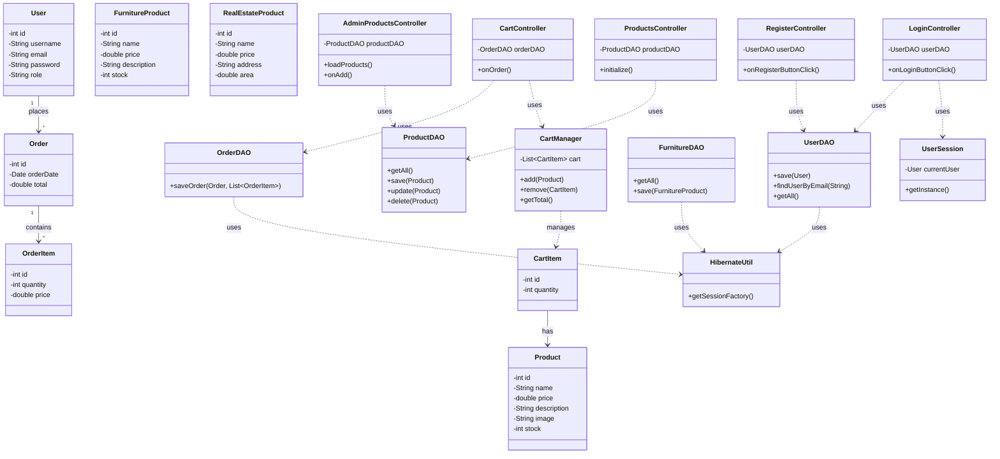

# Diagramme de Classes

```mermaid
classDiagram
    %% Models
    class User {
        -int id
        -String username
        -String email
        -String password
        -String role
    }

    class Product {
        -int id
        -String name
        -double price
        -String description
        -String image
        -int stock
    }

    class FurnitureProduct {
        -int id
        -String name
        -double price
        -String description
        -int stock
    }

    class RealEstateProduct {
        -int id
        -String name
        -double price
        -String address
        -double area
    }

    class CartItem {
        -int id
        -int quantity
    }

    class Order {
        -int id
        -Date orderDate
        -double total
    }

    class OrderItem {
        -int id
        -int quantity
        -double price
    }

    %% Relationships Models
    CartItem --> Product : has
    Order "1" --> "*" OrderItem : contains
    User "1" --> "*" Order : places

    %% DAOs
    class UserDAO {
        +save(User)
        +findUserByEmail(String)
        +getAll()
    }
    class ProductDAO {
        +getAll()
        +save(Product)
        +update(Product)
        +delete(Product)
    }
    class OrderDAO {
        +saveOrder(Order, List~OrderItem~)
    }
    class FurnitureDAO {
        +getAll()
        +save(FurnitureProduct)
    }

    %% Utils
    class CartManager {
        -List~CartItem~ cart
        +add(Product)
        +remove(CartItem)
        +getTotal()
    }
    class UserSession {
        -User currentUser
        +getInstance()
    }
    class HibernateUtil {
        +getSessionFactory()
    }

    %% Controllers (View Logic)
    class LoginController {
        -UserDAO userDAO
        +onLoginButtonClick()
    }
    class RegisterController {
        -UserDAO userDAO
        +onRegisterButtonClick()
    }
    class AdminProductsController {
        -ProductDAO productDAO
        +loadProducts()
        +onAdd()
    }
    class CartController {
        -OrderDAO orderDAO
        +onOrder()
    }
    class ProductsController {
        -ProductDAO productDAO
        +initialize()
    }

    %% Relationships Logic
    LoginController ..> UserDAO : uses
    LoginController ..> UserSession : uses
    RegisterController ..> UserDAO : uses
    AdminProductsController ..> ProductDAO : uses
    CartController ..> OrderDAO : uses
    CartController ..> CartManager : uses
    CartManager ..> CartItem : manages
    ProductsController ..> ProductDAO : uses
    UserDAO ..> HibernateUtil : uses
    OrderDAO ..> HibernateUtil : uses
    FurnitureDAO ..> HibernateUtil : uses
```
